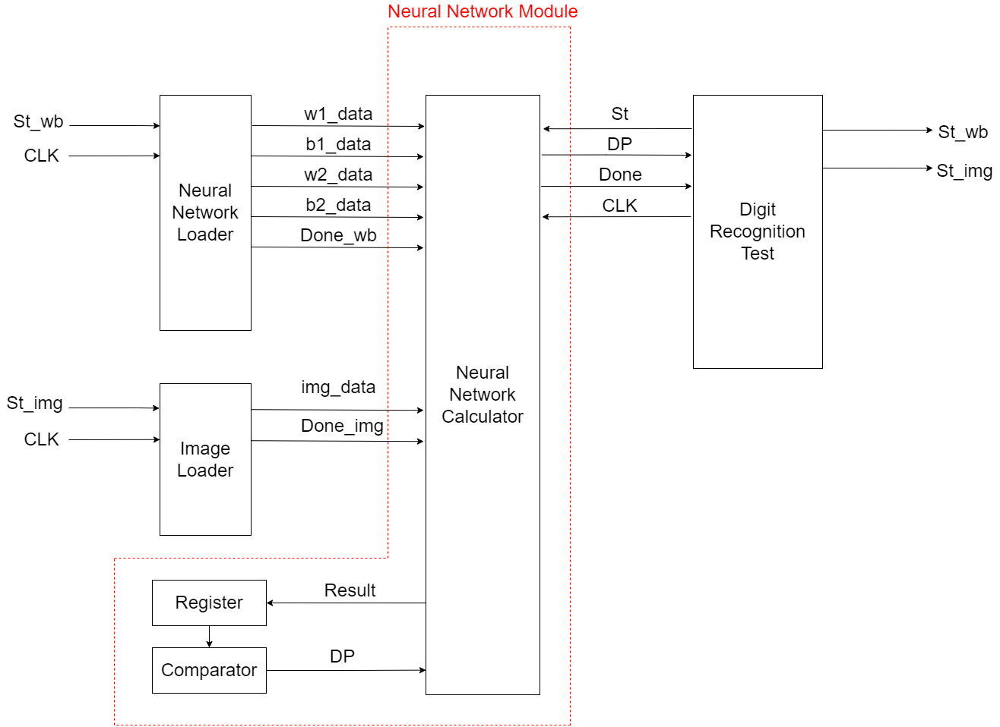
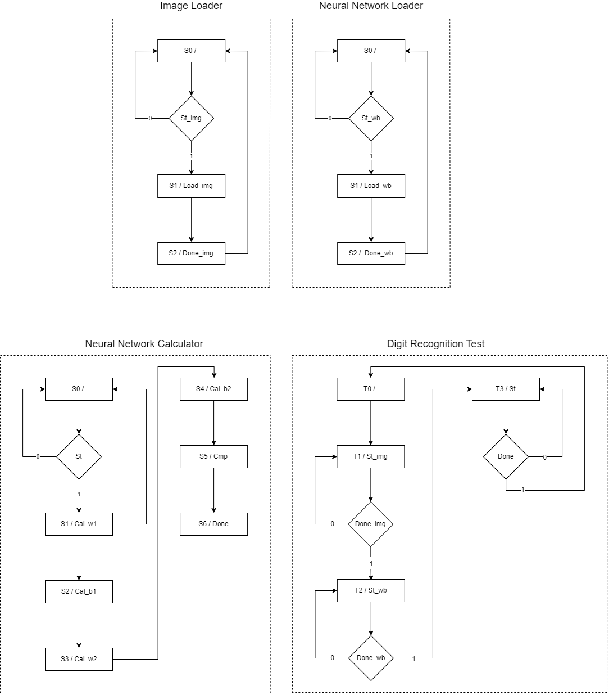
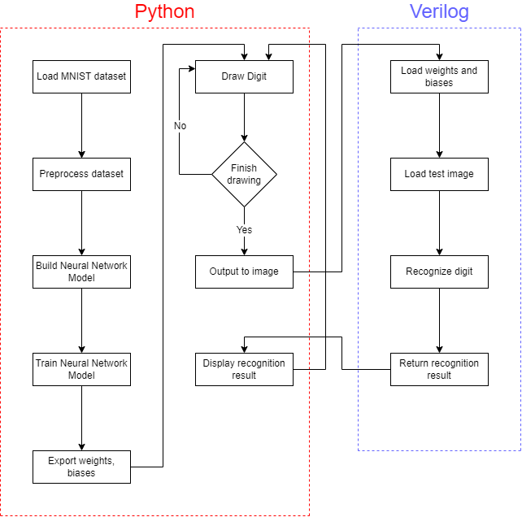

# Verilog Handwritten Digit Recognition

An MNIST digit recognizer whose entire neural-network forward pass runs in **Verilog**: draw a digit in a Python GUI, and an FSM-driven Verilog simulation computes the prediction and sends it back to the canvas.



## Highlights

- **Complete NN inference in Verilog**: both matrix multiplications, bias additions, ReLU, and argmax of a 784→128→10 MLP are executed by a 6-state FSM in [`verilog/nn_recognize.v`](verilog/nn_recognize.v) — no external math libraries.
- **Custom fixed-point weight encoding**: Keras float weights are scaled by 10⁸ and encoded in a sign-magnitude hex format (negative values offset by `0x8000000`), exported with NumPy and decoded back inside Verilog after `$readmemh` — a simple scheme that moves 100,352 trained weights across the Python/Verilog boundary.
- **Interactive end-to-end loop**: pygame drawing canvas → OpenCV preprocessing (crop, grayscale, resize to 28×28, invert) → Icarus Verilog compile & simulate → prediction rendered back onto the canvas, all triggered automatically one second after the pen lifts.

## How it works

```
pygame canvas ──(draw digit)──> OpenCV preprocess ──> hex_img.hex
                                                        │
        GUI shows result <── stdout <── vvp simulation <─┘
                                        (nn_recognize.v FSM:
                                         load weights → matmul₁ → +bias/ReLU
                                         → matmul₂ → +bias → argmax)
```

The Verilog side is organized as a state machine — weight/image loading, layer-1 multiply, bias + ReLU, layer-2 multiply, bias, and argmax each occupy a state:



<details>
<summary>Full program flowchart</summary>



</details>

## Repository layout

| Path | Purpose |
|---|---|
| `verilog/nn_recognize.v` | NN inference: `$readmemh` weight loading, FSM forward pass, argmax |
| `training_nn.py` | Trains the 784→128→10 MLP on MNIST (Keras) and exports weights/biases as hex |
| `main.py` | pygame drawing GUI; preprocesses the drawing and drives the Verilog simulation |
| `data/*.hex` | Pre-trained weights/biases + the most recent input image |
| `test_examples/` | Sample digit drawings (0–9) |
| `docs/` | Block diagram, SM chart, flowchart |

## Build & Run

Requirements: Python 3, [Icarus Verilog](http://iverilog.icarus.com/) (`iverilog`/`vvp`), and optionally GTKWave for waveform inspection.

```bash
pip install -r requirements.txt

# run the interactive recognizer (pre-trained weights included)
python main.py
# draw a digit; recognition triggers automatically ~1s after you release the mouse

# optional: retrain the model and regenerate the hex weights
python training_nn.py
```

## Design notes

- The Verilog model uses `real` arithmetic and `$readmemh`, targeting **simulation** (Icarus Verilog), not synthesis — the goal was to implement and verify the full inference dataflow at the RTL-modeling level.
- Weight encoding uses sign-magnitude rather than two's complement to keep the hex export from NumPy and the decode logic in Verilog trivially symmetric.

## Context

Term project for Digital Systems Design at NYCU (Fall 2022), taught by Prof. Jean Jyh-Jiun Shann; a team of two. I was responsible for the Verilog inference engine and the training/weight-export pipeline; my teammate built the drawing GUI. Design discussion is documented on [HackMD](https://hackmd.io/@Ren-Hao-Deng/Verilog_Handwritten_Digit_Recognition).
